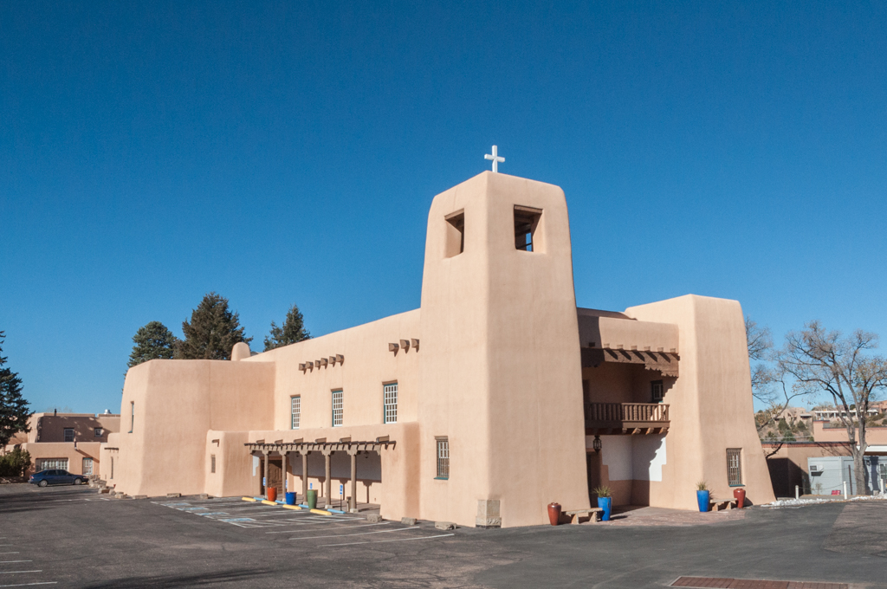

# Deep Architects
> Authors: Mitch Veele, Richard Aw, Wolfgang Herwald

Using deep learning to identify the architectural styles of buildings

## Introduction

Reach out. What do you see?

<!--
(<a href="https://www.mouseplanet.com/gallery/v/PersonalContributions/toddking/lastjedi/star-wars-last-jedi-luke-trains-rey-reach-out-rolls-eyes.jpg.html">Image Source</a>) --> 

 

(<a href="https://www.mouseplanet.com/gallery/v/PersonalContributions/toddking/lastjedi/star-wars-last-jedi-luke-trains-rey-reach-out-rolls-eyes.jpg.html">Image Source</a>)

<!--
(<a href="https://sah-archipedia.org/buildings/NM-01-049-0178">Image Source</a>) -->

Pueblo-style architecture

At its roots, architecture exists to create the physical environment in which people live, but architecture is more than just the built environment, it's also a part of our culture. It stands as a representation of how we see ourselves, as well as how we see the world.

**Goal**
An architect once told me: When you learn about ancient cultures, the first thing people point to is their architecture, because it’s so expressive of who they were. The example they used was ancient Egypt. Take a look at the pyramids and the Sphinx, and you’ll get a good idea of how they regarded their rulers, their religion, and the qualities of the land that they drew their building materials from. The towering feats of delicate, narrative stone masonry that made up Gothic architecture, emerging in Europe in the Middle Ages, was a perfect counterpoint to its age of reverence verging on fear of divinity, during a period of grim instability. The Industrial Revolution, which re-organized the world along rational standards of machine production, inevitably birthed Modernism, which used mass-produced steel and glass to replicate this emerging order in cities. All revolutions, especially political ones, turn to architecture immediately to create their most prominent monuments. And this ability of architecture to explain its age happens whether a building is an elaborate showpiece or a banal standby.

## Methodology

## Results

## Conclusion
Uncultured folks

**Requirements**
It must contain a nice notebook walking through the code of your project
Any code/scripts/models written/developed for the project
Slides for your presentation
A ReadMe that is 1) neat 2) clearly explains the project, the goal, and the outcome 3) has at least one visualization/picture of some kind
All of these things must be easy to find in the GitHub from the ReadMe
