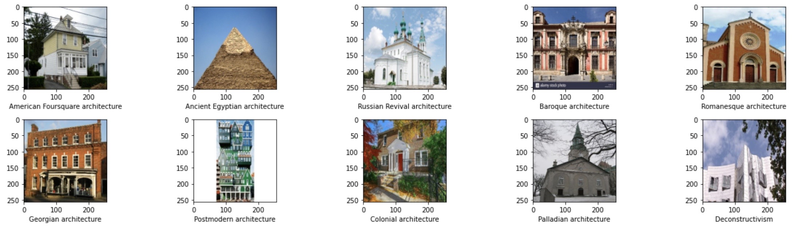
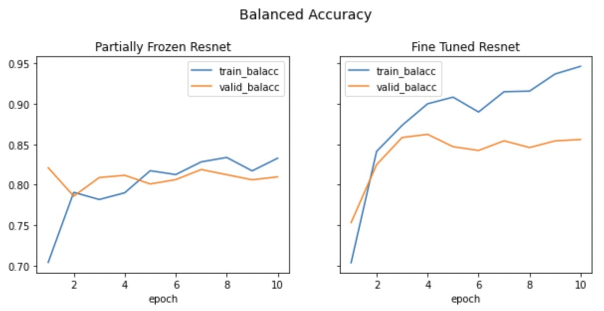
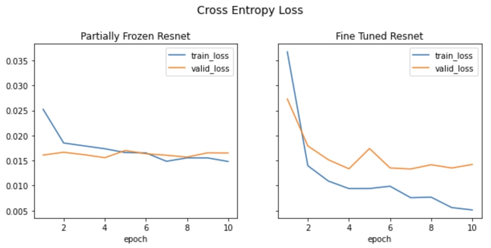

# Deep Architects

> Authors: Mitch Veele, Richard Aw, Wolfgang Herwald

Using deep learning to identify the architectural styles of buildings.

## Introduction

Reach out. What do you see?

 

<!-- (<a href="https://www.mouseplanet.com/gallery/v/PersonalContributions/toddking/lastjedi/star-wars-last-jedi-luke-trains-rey-reach-out-rolls-eyes.jpg.html">Image Source</a>) -->

<!-- (<a href="https://sah-archipedia.org/buildings/NM-01-049-0178">Image Source</a>) -->

The *shallow* response: a church.

(A better response: God.)

The *deep* response: a church designed in the **Pueblo Revival style**.

Jokes aside, the picture on the right shows the Cristo Rey Church, a Roman Catholic church in Santa Fe, New Mexico. Besides being potentially the largest building made of [adobe](https://en.wikipedia.org/wiki/Adobe) in the United States, it was also designed in the Pueblo Revival style –– an architectural style that draws inspiration from New Mexico's historic Spanish missions. In fact, this church is just one of many buildings in Santa Fe designed in the Pueblo Revival style, paying homage to the city's Pueblo and Spanish roots. 

This, hopefully, illustrates why knowing the architectural style of a building is valuable. **The architectural style of a building can often give us a glimpse of the rich history and cultural heritage of a place!**

> From a practical perspective, having such knowledge could impress a date too :)

The excerpt below provides a very nice elaboration:

> "An architect once told me: When you learn about ancient cultures, the first thing people point to is their architecture, because it’s so expressive of who they were. The example they used was ancient Egypt. Take a look at the pyramids and the Sphinx, and you’ll get a good idea of how they regarded their rulers, their religion, and the qualities of the land that they drew their building materials from. The towering feats of delicate, narrative stone masonry that made up Gothic architecture, emerging in Europe in the Middle Ages, was a perfect counterpoint to its age of reverence verging on fear of divinity, during a period of grim instability. The Industrial Revolution, which re-organized the world along rational standards of machine production, inevitably birthed Modernism, which used mass-produced steel and glass to replicate this emerging order in cities. All revolutions, especially political ones, turn to architecture immediately to create their most prominent monuments. And this ability of architecture to explain its age happens whether a building is an elaborate showpiece or a banal standby." (<a href="https://studyarchitecture.com/blog/architecture-news/why-architecture-is-important/">Source</a>)

### Goal

Therefore, our team sought to develop a multi-class convolutional neural network (CNN) model that can identify the architectural style of a building, if given an image of said building.

## Methodology

### Dataset

We used 10,113 images of buildings from 25 architectural styles (class labels). (<a href="https://www.kaggle.com/datasets/dumitrux/architectural-styles-dataset">Source</a>)

The images were a mix of images scraped from Google Images and the dataset from <a href="https://link.springer.com/chapter/10.1007/978-3-319-10590-1_39"> this paper</a>.

   
  
    
  <em>A snippet of the dataset</em>  

We also performed data augmentation (i.e., making slight modifications to images, such as vertical and horizontal flips, to synthesize more data). This is a regularization technique that can help reduce overfitting when training our model later.

### Model

#### Architecture

We used the ResNet-18 CNN model. 

> *Rationale:* Deeper neural networks are more difficult to train. Residual learning can help ease the training of networks that are substantially deeper than those used previously. In residual learning, the layers in a CNN are reformulated as learning residual functions with reference to the layer inputs, instead of learning unreferenced functions. Empirical evidence suggests that these residual networks are easier to optimize, and can gain accuracy from considerably increased depth. 

#### Initialization

We initialized the parameters of our model in three (or two, really) ways:

1. Froze *some* layers from a pretrained model

> This would reduce the training time without losing too much accuracy. (Similar to drop-out, which has been shown empirically to accelerate and improve the efficiency of the training process without having every layer in a neural network to be trained.)

2. Fine-tuned the same pretrained model

> This would, ostensibly, help tailor the weights of the model more toward the data points in our dataset.

3. Randomly initialize the weights ("train from scratch") 

> This approach was eventually abandoned due to the excessive amount of time that passed during training. (Moral of the story: transfer learning *is* key!)

### Training Procedure

The training process involved two noteable "deviations" from the typical training procedure:

1. We used a modified loss function (by weighting classes unequally). 

> *Rationale:* This helps account for the class imbalance present in the dataset.

2. We used a cyclic learning rate.

> *Rationale:* Changing the learning rate periodically for stochastic gradient descent has been shown to improve performance while also cutting down on training time. 

## Results

As the plots below show, our trained model yielded decent values on metrics on the validation data:

### Accuracy vs epoch count

### Training Loss vs epoch count

## Conclusion

Identifying the architectural style of a building can be a fun and meaningful activity, since it can satisfy our natural curiosity about the past. A possible extension of this project could be to incorporate our trained model into a building architecture discovery application -- similar to other applications such as Pokemon Go (pokemon discovery) and <a href="https://apps.apple.com/us/app/shazam-music-discovery/id284993459"> Shazam</a> (music discovery).

<!-- **Requirements**
It must contain a nice notebook walking through the code of your project
Any code/scripts/models written/developed for the project
Slides for your presentation
A ReadMe that is 1) neat 2) clearly explains the project, the goal, and the outcome 3) has at least one visualization/picture of some kind
All of these things must be easy to find in the GitHub from the ReadMe -->
